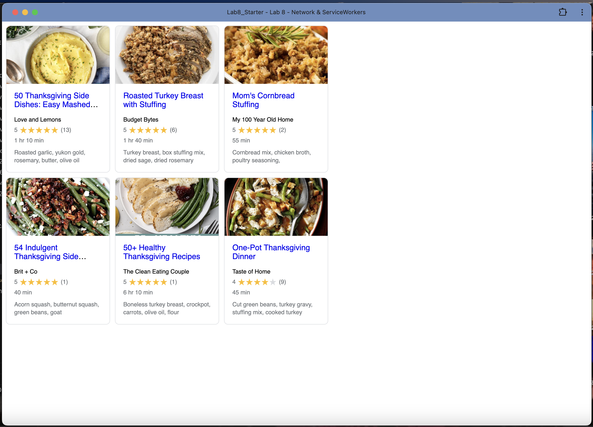

# Lab8-Starter
Alexis Vanessa Vega

site: https://alexisvvega.github.io/RecipeApp/

## How are graceful degradation and service workers related?

Graceful degradation is a design strategy where you work from interactivity down (most advanced features first), so JS to HTML. Service workers support graceful degradation by allowing a web app to maintain basic functionality offline or with a poor network connection. They intercept network requests and serve cached versions of files, so users can still view pages and access content even when disconnected. This helps maintain usability and performance, making web apps more resilient and accessible in various environments.

## PWA Screenshot

